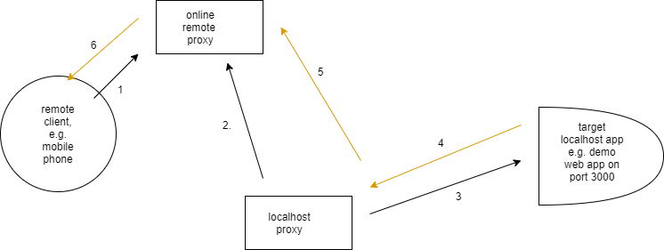

# backend-local-forward-proxy

Works together with [backend-reverse-proxy](https://github.com/aaronicsubstances/backend-reverse-proxy) to provide http proxy for web applications running on localhost.

## Setup

Launch with 
```
npm install -g backend-local-forward-proxy
local-forward-proxy
```

The configuration for the script is dependent on environment variables. As a convenience, the current directory from which `local-forward-proxy` script is launched can contain .env.json and .env files for completing the setup. See .env.sample and .env.json.sample for available environment variables to use.

The most important of them is CONNECTION_INFO_LIST, which has to be set for the application to run. Also available is REQUEST_TIMEOUT_MILLIS, which defaults to 10 seconds.

The CONNECTION_INFO_LIST environment variable is a JSON array (or serialised JSON array), where each array item has 3 fields:

   * `targetAppId`: uuid/guid identifying a target url to a backend-reverse-proxy instance.
   * `reverseProxyBaseUrl`: backend-reverse-proxy base url
   * `targetAppBaseUrl`: target web application base url

To "comment out" an item in the array, include an `exclude` field in the item which is set to true.

## Architecture




   1. remote client makes http request to running instance of backend-reverse-proxy on the Internet. reverse-proxy records http request and puts remote client on hold, waiting for local-forward-proxy to pick it up for processing.
   
   2. backend-local-forward-proxy continuously polls reverse-proxy, and eventually discovers and picks up http request headers and body from remote client.

   3. local-forward-proxy makes normal http request to target localhost service (the one remote client actually wants to reach but cannot reach directly) using received request headers and body.

   4. target localhost service responds to local-forward-proxy with http response headers and body.
 
   5. local-forward-proxy makes normal http request to reverse-proxy, and transfers received response headers and body to it.

   6. reverse-proxy wakes up remote client and transfers received response headers and body to it as its final response.

Remote clients make http request to backend-reverse-proxy deployments at paths with prefix/base of the form **/main/\[target_app_id\]**, where *target_app_id* is a uuid/guid configured at a running backend-local-forward-proxy instance to map to a given target app base url.

By this arrangement, a single online remote proxy deployment can serve multiple localhost proxies, as long as each localhost proxy is careful to use a different set of uuids/guids.

## API

Although the entire language above refers to project as running on localhost, actually this project can be deployed online and still used to target apps which are accessible to the deployment, but inaccessible to remote clients (e.g. behind firewall or VPN).

To help with that, adapt the code from [bin/local-forward-proxy.js](https://github.com/aaronicsubstances/backend-local-forward-proxy/tree/main/bin/local-forward-proxy.js) as needed. The most important class/function provided is:

```js
class DuplexAgent {
    constructor(targetAppId: string, reverseProxyBaseUrl: string, targetAppBaseUrl: string, requestTimeoutMillis?: number);
    stop(): void;
    start(): void;
}
```